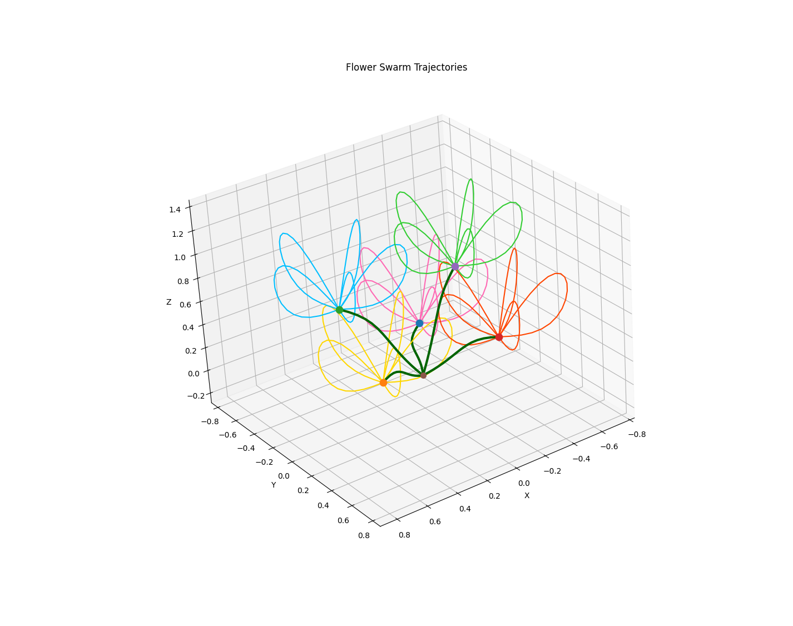

# Crazyflie Flower Swarm

A repository for generating 3D flower trajectories for a swarm of Crazyflie drones.

## Python — generate trajectories

### With uv (recommended)

```bash
uv sync
uv run flower.py
```

### With pip

```bash
python3 -m venv .venv
source .venv/bin/activate
pip install .
python3 flower.py
```

No system packages required — all dependencies install via pip/uv.

Running `flower.py` will:
- Display an interactive 3D plot of the flowers
- Write `flower_trajectories/stem{n}.json` and `flower_trajectories/petals{n}.json`



## Rust — fly the swarm

### Install Rust

If you don't have Rust installed:

```bash
curl --proto '=https' --tlsv1.2 -sSf https://sh.rustup.rs | sh
source $HOME/.cargo/env
```

### Run

1. Generate the trajectories with `flower.py` (see above)
2. Set the drone URIs in `examples/flower_swarm_compressed.rs`
3. Run:

```bash
cargo run --example flower_swarm_compressed
```


